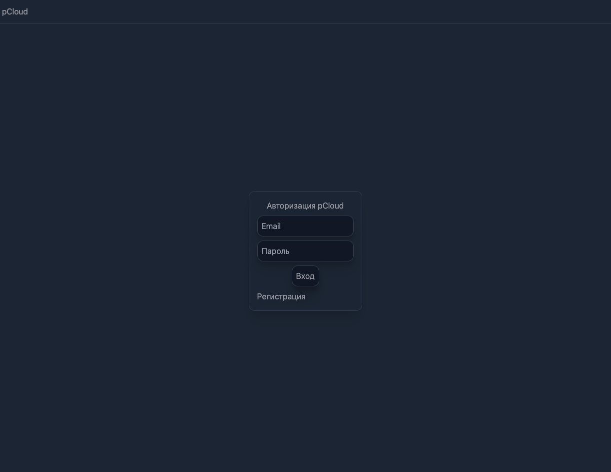

# pCloud - cloud file storage
pCloud - The application is designed for deployment on a home server, cloud file storage

## Application architecture

### ./client - web interface for interacting with the storage.
    Functionality: 
        - authorization 
        - registration 
        - downloading files 
        - uploading files 
        - deleting files 
        - viewing files

    Stack: 
        - React 
        - Zustand 
        - Tailwind CSS 
        - TypeScript
        - Axios

# ./server - application for interacting with the database and file system of the server
    Functionality: 
        - upload files
        - download files
        - delete files
        - add user in database

    Stack: 
        - Express JS
        - Sequlize JS
        - Node JS

# postgres - database for storing user accounts

# RUN in homeserver
    - clone repository
    - create folder ./share - cloud storage
    `sudo docker-compose build`
    `sudo docker-compose up -d`
    - use app in 4000 port

